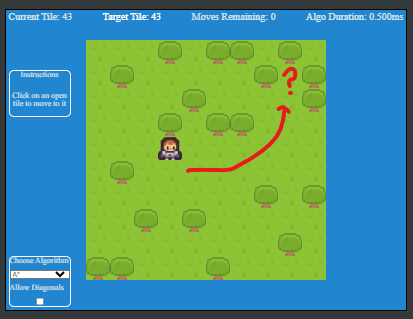
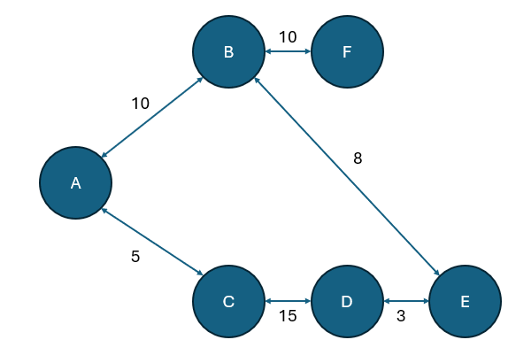
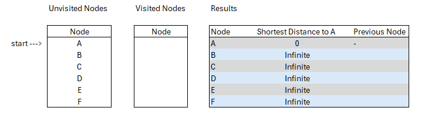
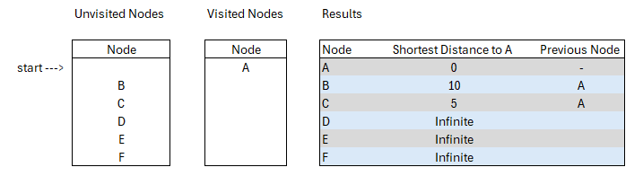

One of the most common problems that need solved in game development is navigating from one tile to a separate tile somewhere else. Or
sometimes, I need just to understand if that path is clear between one tile and another. Sometimes you can have a graph node tree, and
need to understand the cheapest decision. These are the kinds of challenges where one could use a pathfinding algorithm to solve.

[Link to Pathfinding Demo](https://excaliburjs.com/sample-pathfinding/)

## Pathfinding, what is it

Quick research on pathfinding gives a plethora of resources discussing it. Pathfinding is calculating the shortest path through some
'network'. That network can be tiles on a game level, it could be roads across the country, it could be ailses and desks in an office,
etc etc.

Pathfinding is also a algorithm tool to calculate the shortest path through a graph network. A graph network is a series of nodes and
edgest to form a chart. For more information on this, I recommend googling 'Graph Theory'

For the sake of clarity, there are two algorithms we specifically dig into with this demonstration: Dijkstra's Algorithm and A\*. We
studied Dijkstra's Algorithm in [Part 1](./pathfindingpart1.md).

## Quick History

### Dijkstra's Algorithm

Dijkstra's Algorithm is an algorithm for finding the shortest path through a graph that presents wieghting (distances) between
different nodes. The algorithm essentially dictates a starting node, then it systematically calculates the distance to all other nodes
in the graph, thus, giving one the ability to find the shortest path. 

Edsger Dijkstra, in Amsterdam, was sipping coffee at a cafe in Amserdam in 1956, and was working through a mental exercise regarding
how to get fromRoggerdam to Groningen. Over the course of 20 minutes, he figured out the algorithm. In 1959, it was formally published.

### A\* pathfinding

TODO - add more

## Algorithm Walkthrough

### Dijkstra's Algorithm

Let's start with this example graph network. We will manage our walkthrough using a results table and two lists, one for unvisited
nodes, and one for visited nodes.

Let's declare A our starting node and update our results object with this current information. Since we are starting at node A, we then
review A's connected neighbors, in this example its nodes B and C.

Knowing that B is distance 10 from A, and that C is distance 5 from A, we can update our results chart with the current information.

With that update, we can move node A from unvisited to visited list, and we have this new state.

Now the algorithm can start to be recursive. We identify the node with the smallest distance to A of our unvisited nodes. In this
instance, that is node C.

Now that we are evaluating C, we start with identifying its unvisited neighbors, which in this case is only node D. The algorithm would
update all the unvisited neighbors with their distance, adding it to the cumulative amount traveled from A to this point. So with that,
D has a distance of 15 from C, and we'll add that to the 5 from A to C.

We continue to repeat this algorithm until we have visited all nodes.

## The test

[Link to Demo](https://mookie4242.itch.io/goap-ai-simulation-using-excaliburjs-engine)

TODO - Explain the demo

## Conclusion

TODO - explain the article
