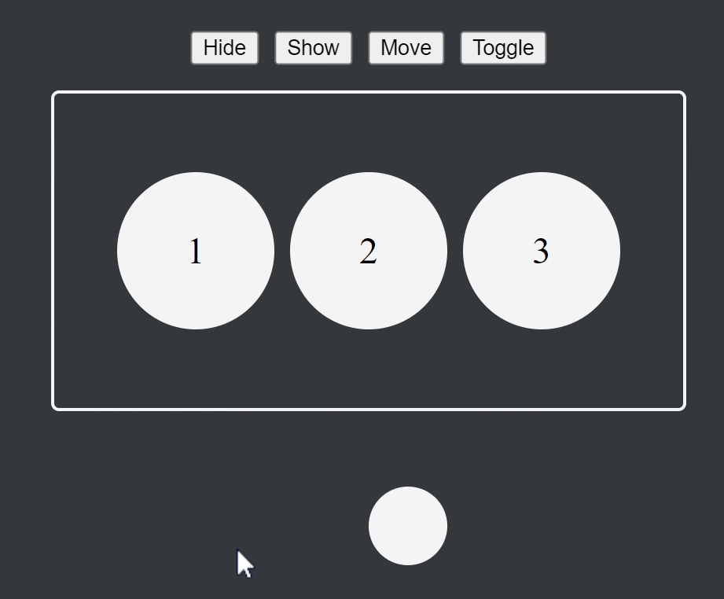
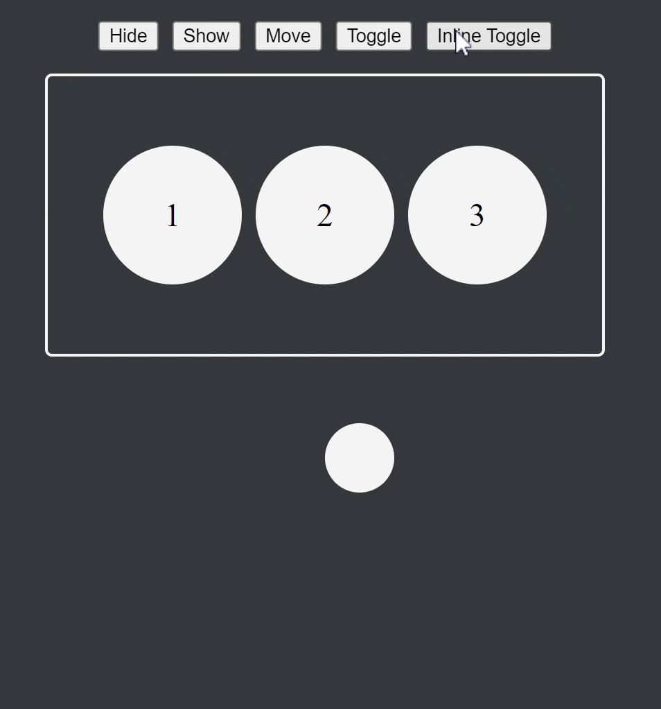
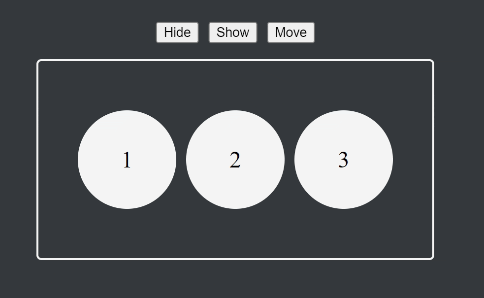
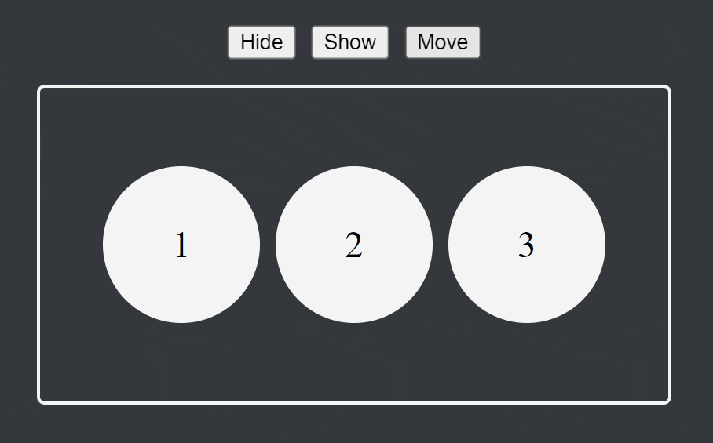

# Controlling CSS with Peasy-UI: Part 4 of the Peasy-UI Series

<!-- TABLE OF CONTENTS -->
<details>
  <summary>Table of Contents</summary>
  <ol>
    <li><a href="#introduction">Introduction</a></li>
    <li><a href="#bindings-and-elements">Bindings for events</a></li>
    <li><a href="#callback-params">Callback Params</a>
      <ul>
        <li><a href="#event">Event</a></li>
        <li><a href="#data-model">Data Model</a></li>
        <li><a href="#target-element">Target Element</a></li>
        <li><a href="#event-string">Event String</a></li>
        <li><a href="#parent-data-object">Parent Data Object</a></li>
      </ul>
    </li>
    <li><a href="#more-information">More information</a></li>
    <li><a href="#conclusion">Conclusion</a></li>
  </ol>
</details>

## Introduction

In my latest installment of the Peasy-UI library series we are going to dive another layer deeper. In this entry, we will cover how you
can use both internal CSS and inline CSS bindings with Peasy-UI. We also are going cover the CSS helper classes that are made available
using Peasy to assist with animations. We will dig into each of the three classes that are available, and we can cover how they can be
used in your template and bind elements to these helper classes.

If you missed the introduction article for Peasy-UI, you can read it
[here](https://dev.to/jyoung4242/introduction-to-peasy-ui-part-1-of-the-peasy-ui-series-4gi8), and it can provide the overview for the
library, and even introduces upcoming topics in the series.

## Binding CSS Properties

In this section, let's cover different strategies of using Peasy-UI's bindings with CSS.

### Internal CSS

When I am binding style properties for a Peasy-UI component or small application, my primary approach is to use the standards
`<style></style>` block above my html that I am using. Let's take a look at a quick example.



In this example I have a toggle button, which when cliced is transitioning the elements position back and forth.

In my DOM template:

```html
...
<button \${click@=>toggle}>Toggle</button>
...
<test-element></test-element>
...
```

My CSS for this:

```css
test-element {
  position: fixed;
  top: 50%;
  left: 50%;
  width: 50px;
  aspect-ratio: 1/1;
  background-color: whitesmoke;
  border-radius: 50%;
  transform: translate(-\${leftPercent}px, 150px);
  transition: transform 0.9s ease-in-out, scale 0.9s ease-in-out;
  scale: 1;
}
```

In my data model, our logic:

```ts
const model = {
  toggleFlag: true,
  leftPercent: 0,
  toggle: (_e: HTMLElement, m: any) => {
    if (m.toggleFlag) m.leftPercent = 100;
    else m.leftPercent = 0;
    m.toggleFlag = !m.toggleFlag;
  },
};
```

When the `toggle` method is fired by clicking the button, we use the `m.toggleFlag` to track our toggle state, and also set the
`m.leftPercent` property to different values. This is the first way I bind CSS properties in Peasy-UI. Another trick I use is I can
change the color string of CSS property to transition colors as well.

```css
test-element {
  ...
  background-color: \${colorString};
  ...
}
```

```ts
  const model = {
    ...
    colorString: "whitesmoke",
    ...
  };
```

I can just change the string to other css colorstrings to change the elements color, or you can use a hexstring.

### Inline CSS

For more complicated CSS manipulation, sometimes I have added bindings to inline class attributes on elements. That way I can bind a
string in the data model, and can control specifically what CSS classes I want active on an element. Let's take a look at a quick
example.



In this demonstration you see the test element is toggled on its scale property. Let's take a quick look at how I am accomplishing
this.

In my DOM template:

```html
...
<button \${click@=>inlinetoggle}>Inline Toggle</button>
...
<test-element class="\${testClassName}"></test-element>
...
```

my css for this:

```css
test-element {
  position: fixed;
  top: 50%;
  left: 50%;
  width: 50px;
  aspect-ratio: 1/1;
  background-color: whitesmoke;
  border-radius: 50%;
  transform: translate(-\${leftPercent}px, 150px);
  transition: transform 0.9s ease-in-out, scale 0.9s ease-in-out;
  scale: 1;
}

.scaleTestElement {
  scale: 1.5;
}
```

and in my data model:

```ts
export const model = {
  ...
  inlinetoggleFlag: false,
  testClassName: "",
  ...
  inlinetoggle: (_e: HTMLElement, m: any) => {
    if (m.inlinetoggleFlag)  m.testClassName = "";
    else  m.testClassName = "scaleTestElement";
    m.inlinetoggleFlag = !m.inlinetoggleFlag;
  },
};
```

Let's breakdown what aspects are highlighted here. Let's start with the toggle button being used to trigger the change, that's a simple
button element with a click event binding the `inlinetoggle` method in the data model to the button. When that method is called, the
data model uses a toggle flag, `m.inlinetoggleFlag` to track a toggle state, and it also changes the `m.testClassName` string. In the
template DOM, the `test-element` has a class attribute with a string binding in it. What happens when you update the string in the data
model, is the new class gets added to the element, changing the scale property. Also, you can see the transition property of the
element covers the scale property as well.

You can tighly control what class are attached to an element via inline CSS bindings like this.

## The Three Helpers

This section will discribe the functionality and implementation details of three native CSS helper classes that are used in Peasy-UI.
This features happen natively regardless if they are taken advantage of or not. These three helpers are: pui-adding, pui-removing, and
pui-moving. These are class names added to elements that are being manipulated by Peasy-UI, and are available to be leveraged for
managing transitions.

### pui-adding

This CSS class is added to an element when it transitions from not rendered to rendered. This can happen in a couple scenarios. If you
are adding an element to a list that's rendered with the `<=*` binding, then that new element receives the `pui-adding` class. Another
means of adding an element is by using the rendering binding `===` or `!==`. To review the availble bindings for Peasy-UI, you can
reference this article on the bindings here:
[Bindings and Templates: Part 2 of the Peasy-UI series](https://dev.to/jyoung4242/bindings-and-templates-part-2-of-the-peasy-ui-series-k44)

The duration of the class adding is until any/all transitions tied to `pui-adding` class is complete. Let's take a deeper look at this.

```ts
const model = {
  isDivShowing: false,
};

const template = `

<style>
    .child{
      opacity: 1;
      transition: opacity 1.0s;
    }

    .child.pui-adding{
      opacity: 0;
    }
</style>

<div class="parent">
  <div class="child" \#{===isDivShowing}>
      Hello World
  </div>
</div>
`;

UI.create(document.body, model, template);
```

In this example what you will see is that if/when you set `model.isDivShowing` to true, Peasy-UI will add the element to the DOM,
starting with the `pui-addding` class. The `pui-adding` class will automatically be removed from the element upon the completion of the
1 second CSS transition that is set for the opacity property.

### pui-removing

You will see quickly that the `pui-removing` class helper is the opposite of `pui-adding.`

This CSS class is added to an element when it transitions from rendered to not rendered. This can happen in a couple scenarios. If you
are removing an element from a list that's rendered with the `<=*` binding, then that element which is being removed receives the
`pui-removing` class. Another means of removing an element is by using the rendering binding `===` or `!==`.

The duration of the class removing is until any/all transitions tied to `pui-removing` class is complete. Let's take a deeper look at
this.

```ts
const model = {
  isDivShowing: true,
};

const template = `

<style>
    .child{
      opacity: 1;
      transition: opacity 1.0s;
    }

    .child.pui-removing{
      opacity: 0;
    }
</style>

<div class="parent">
  <div class="child" \#{===isDivShowing}>
      Hello World
  </div>
</div>
`;

UI.create(document.body, model, template);
```

In this example, what you will see is that when you set `model.isDivShowing` to false, Peasy-UI will add the `pui-removing` class to
the element prior to transitioning the element from the DOM. The `pui-removing` class will remain on the element upon the completion of
the 1 second CSS transition that is set for the opacity property, of which the entire element is removed from the DOM completely.

### show/hide example

In this example we are working with a DOM template that renders this:

```html
<div>
    <div class="controls">
        <button \${click@=>hide}>Hide</button>
        <button \${click@=>show}>Show</button>
        <button \${click@=>move}>Move</button>
    </div>
    <element-container>
        <inner-element \${el<=*elements}>
            \${el.id}
        </inner-element>
    </element-container>
</div>
```

You can see the `inner-element` div has a list binding that takes the elements array and lists out an `inner-element` for each item in
the list, and places the `.id` property of each object into the content for the element.

For the sake of this quick demo, we are simply using a fixed data model: (showing only the elements array)

```ts
export const model = {
  elements: [
    {
      id: 1,
    },
    {
      id: 2,
    },
    {
      id: 3,
    },
  ],
  //... click bindings below
```

What is important here is the CSS styling we added to the rendered template

```css
inner-element {
  ...
  /*other properties that aren't relevant above*/
  transition: opacity 0.9s, background-color 1.2s;
  opacity: 1;
  background-color: whitesmoke;
}

inner-element.pui-adding {
  opacity: 0;
}

inner-element.pui-removing {
  opacity: 0;
}
```

In the click handlers for the Hide and Show buttons, we are simply removing and adding the elements from the array. Nothing fancy, but
it exercises how Peasy-UI uses the helper classes to manage the CSS transitions. The classes, both `pui-adding` and `pui-removing` are
added, and then the opacity transition of 0.9 seconds starts, then the classes are removed. This is how you can use Peasy-UI to manage
element transitions.



### pui-moving

This CSS class is added to an element when the element is a part of a list or array, and moves indexes within that list.

The duration of the class adding is until any/all transitions tied to `pui-adding` class is complete. Let's take a quick look at this.



In this example, we are using the .pui-moving class to change the elements red that are moving, and this transition happens over time,
and after the transition period, the array is rendered with the updated order to the DOM.

Our DOM template:

```html
<button \${click@=>move}>Move</button>
<element-container>
  <inner-element \${el<="*elements}"> \${el.id} </inner-element>
</element-container>
```

Our CSS:

```css
inner-element {
  width: 100px;
  aspect-ratio: 1/1;
  background-color: whitesmoke;
  border-radius: 50%;
  color: black;
  display: flex;
  justify-content: center;
  align-items: center;
  font-size: 24px;
  transition: opacity 0.9s, background-color 1.2s, left 0.9s;
  opacity: 1;
  scale: 1;
  left: 0px;
}

inner-element.pui-moving {
  background-color: red;
}
```

and our DOM model logic:

```ts
const model ={
  elements: [...],
   move: (_e: HTMLElement, m: any) => {
    if (m.elements.length > 0) {
      if (m.elements[0].id === 1) {
        moveElement(m.elements, 0, 2);
      } else {
        moveElement(m.elements, 2, 0);
      }
    }
  },
};

function moveElement(array: any[], fromIndex: number, toIndex: number) {
  const element = array.splice(fromIndex, 1)[0]; // Remove the element from the array
  array.splice(toIndex, 0, element); // Insert the element at the new position
}
```

We have a button element that triggers a toggle of sorts, but only based on the content of the `elements` array in the data model. If
the element in the zero index position has an id of 1, then we move that element to the 3rd position, index 2. Otherwise, we move the
element from index 2 into index 0. One observation that can be made, is that moving one element actually forces all the elements in
this example to move, therefore, all three elements get the `pui-moving` class added.

## Conclusion

todo

## More information

More information can be found in the github repo for Peasy-Lib, you also will find all the other companion packages there too. Also,
Peasy has a Discord server where we hang out and discuss Peasy and help each other out.

The author's twitter: [Here](https://twitter.com/jyoung424242)

The author's itch: [Here](https://mookie4242.itch.io/)

Github Repo: [Here](https://github.com/peasy-lib/peasy-lib/tree/main/packages/peasy-ui)

Discord Server: [Here](https://discord.gg/9VsQrVH94Z)
