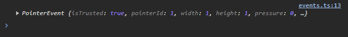
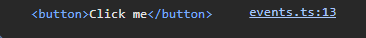
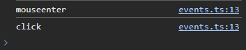

# Binding Events for the DOM: Part 3 of the Peasy-UI Series

<!-- TABLE OF CONTENTS -->
<details>
  <summary>Table of Contents</summary>
  <ol>
    <li><a href="#introduction">Introduction</a></li>
    <li><a href="#bindings-and-elements">Bindings for events</a></li>
    <li><a href="#callback-params">Callback Params</a>
      <ul>
        <li><a href="#event">Event</a></li>
        <li><a href="#data-model">Data Model</a></li>
        <li><a href="#target-element">Target Element</a></li>
        <li><a href="#event-string">Event String</a></li>
        <li><a href="#parent-data-object">Parent Data Object</a></li>
      </ul>
    </li>
    <li><a href="#more-information">More information</a></li>
    <li><a href="#conclusion">Conclusion</a></li>
  </ol>
</details>

## Introduction

Today we are going to dive a layer deeper into the Peasy-UI library. We are going to do a deep dive into binding strategies for user
events in the DOM. User events in the DOM are particularly targeted towards how the user of the app will interact with it. This can be
touch interfaces, mouse pointers and drag, typing into fields, etc...

If you missed the introduction article for Peasy-UI, you can read it
[here](https://dev.to/jyoung4242/introduction-to-peasy-ui-part-1-of-the-peasy-ui-series-4gi8), and it can provide the overview for the
library, and even introduces upcoming topics in the series.

## Bindings for events

Let's dig into the mechanics of capturing user events from the DOM. If want to render a drop down select input, or a button? Peasy-UI
gives you access to mapping the eventlisters automatically and tying them into the data model.

BINDING: `${ event @=> callbackName}`

Buttons provide easy examples for this, but all DOM events can be used. event model Element EventTypes peasy data object

```ts
const model = {
  clickHandler: () => {
    window.alert("I got clicked");
  },
};

const template = `
<div>
    <button \${click @=> clickHandler}> Click Me! </button>
</div>
`;
```

You can bind any HTML DOM event, such as change, input, click, mouseenter, etc... as an event binding, and then you provide the
'handler' callback which exists IN the data model.

### Callback Params

Peasy passes 5 standard parameters into the handler for your convenience.

#### Event

The first parameter is the HTMLEvent that actually is fired.

```ts
const model = {
  clickHandler: (evt: HTMLEvent) => {
    console.log(evt);
  },
};

const template = `
<div>
    <button \${click @=> clickHandler}>Click Me!</button>
</div>
`;
```



#### Data Model

The second parameter is the 'localized' data model that is bound to the element. This CAN be tricky, because depending on your nesting
of elements, it maybe be a localized data model for just that element, or if it is a top level binding, it will be the standard data
model. When we dig into lists and arrays and how Peasy renders them, we will discuss this localized data model and how it can be used.

```ts
const model = {
  isA: true;
  numClicks: 0;
  clickHandler: (evt: HTMLEvent, model: any) => {
    console.log(model);
  },
};

const template = `
<div>
    <button \${click @=> clickHandler}>Click Me</button>
</div>
`;

// will log --> > {isA: true, numclicks: 0, clickHandler: f}
```

#### Target Element

The third parameter is the target element that fired the event, so you can access any attributes nested in the element or its value.

```ts
const model = {
  clickHandler: (evt: HTMLEvent, model: any, elem: HTMLElement) => {
    console.log(elem);
  },
};

const template = `
<div>
    <button \${click @=> clickHandler}>Click Me</button>
</div>
`;
```



#### Event String

The fourth element is the string representation of the event, such as 'click' or 'change' and this helps in case you bind multiple
events to the same callback, you can distinguish which event triggered this callback.

```ts
const model = {
  clickHandler: (evt: HTMLEvent, model: any, elem: HTMLElement, eStr: string) => {
    console.log(eStr);
  },
};

const template = `
<div>
    <button \${click @=> clickHandler} \${mouseenter @=> clickHandler}>Click Me</button>
</div>
`;
```



#### Parent Data Object

The final parameter is the overarching data model. Inside this object, regardless of how nested your binding is, will be an object that
contains the model property, and you can navigate that object to have access to ANY property in the data model. This becomes very
important when you start using arrays and lists for rendering elements.

```ts
const model = {
  clickHandler: (evt: HTMLEvent, model: any, elem: HTMLElement, eStr: string, obj: any) => {
    console.log(obj);
  },
};

const template = `
<div>
    <button \${click @=> clickHandler}>Click Me</button>
</div>
`;

// will log out -->    > {$model:{...}}
```

## More information

More information can be found in the github repo for Peasy-Lib, you also will find all the other companion packages there too. Also,
Peasy has a Discord server where we hang out and discuss Peasy and help each other out.

The author's twitter: [Here](https://twitter.com/jyoung424242)

The author's itch: [Here](https://mookie4242.itch.io/)

Github Repo: [Here](https://github.com/peasy-lib/peasy-lib/tree/main/packages/peasy-ui)

Discord Server: [Here](https://discord.gg/9VsQrVH94Z)

## Conclusion

In this entry of the Peasy-UI library breakdown we dove deeper into how user input DOM events can be bound into the data model so
Peasy-UI can create and manage the eventListeners for you. One unique aspect of the event handlers in the data model is the callback
parameters that are pulled into the callback by default, including: the event object, the data models, the event string, and the HTML
element itself. This gives the developer a unique set of tools to perform very customizable events, but with a favorable developer
experience.
