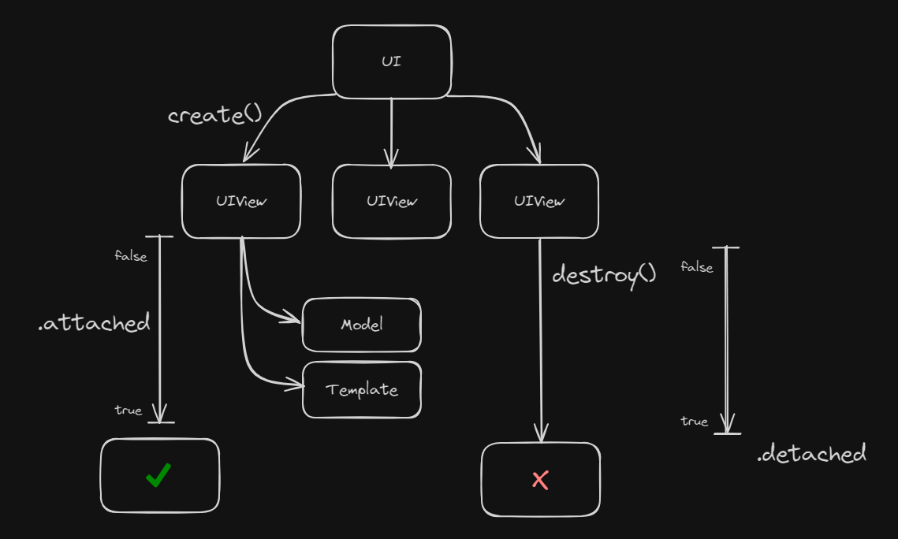

# Introduction to Peasy-UI: Part 1 of the Peasy-UI Series

<!-- TABLE OF CONTENTS -->
<details>
  <summary>Table of Contents</summary>
  <ol>
    <li><a href="#what-is-peasy-ui">What is Peasy-UI?</a></li>
    <li><a href="#how-does-it-work">How does it work?</a></li>
    <li><a href="#usage">Usage</a>
      <ul>
        <li><a href="#using-node-and-a-bundler">Using node and a bundler</a></li>
        <li><a href="#cdn-import">CDN import</a></li>
      </ul>
    </li>
    <li><a href="#uiviews">UIViews</a>
      <ul>
        <li><a href="#api">API</a>
            <ul>
                <li><a href="#create">create</a></li>
                <li><a href="#destroy">destroy</a></li>
                <li><a href="#attached-and-detached">attached and detached</a></li>
                <li><a href="#queue">queue</a></li>
            </ul>
        </li>
      </ul>
    </li>
    <li><a href="#data-model">Data Model</a></li>
    <li><a href="#string-literal-template">String Literal Template</a></li>
    <li><a href="#bindings">Bindings</a></li>
    <li><a href="#more-information">More information</a></li>
    <li><a href="#conclusion">Conclusion</a></li>
  </ol>
</details>

## What is Peasy-UI?

[Peasy-UI](https://github.com/peasy-lib/peasy-lib/tree/main/packages/peasy-ui) (PUI or Peasy) is a small UI binding library. It started
as a hobby project that grew some legs and became more than the author originally intended. Written by
[Jürgen Wenzel](https://github.com/jwx) in early 2022, it started as a response to some game development community conversations around
people attempting to make web based games using SPA frameworks. While SPA frameworks can be used to successfully make games on the web,
most of them come with overhead and overkill for DOM reactivity from a game development and, more importantly, game loop perspective.

So the intent behind Peasy was to provide and ship the bare minimum amount of JavaScript necessary to allow for the library to control
what was being rendered to the DOM, as well as being able to replace DOM content dynamically as a response to changes in the data model
that the library owned and monitored. The design goals of Peasy-UI is to keep the package small (< 10kb), and should not require a
build step to use.

Today, Peasy has grown its feature set to absorb controlling CSS and animations, binding DOM events, and allowing for component based
design. I have even used Peasy to create Single Page Applications ([SPA](https://en.wikipedia.org/wiki/Single-page_application)), which
included a router feature for controlling component content. I have also successfully used server side control of the Peasy client, and
asyncronously controlled the client content. Peasy-UI has also birthed several companion libraries too, such as Peasy-engine,
Peasy-lighting, Peasy-input, Peasy-audio, and others... I have leveraged all of these to make a game framework that is powered by
Peasy: [Squeleto](https://jyoung4242.github.io/Squeleto-Docs/#/)

To sum up: Peasy is powerful enough for most features needed on the web, but intentionally isn't going to replace React, Svelte, or Vue
any time soon. It is extremely lightweight, easy to use,and performant to meet most web challenges.

## How does it work?

Peasy works by the principle of creating UIViews to be rendered inside of the DOM. These UIViews own a data model, and also is provided
a string literal template that represents the HTML to be rendered and parsed by Peasy. The linkage between the template provided and
the data model is through bindings. When parsed, these bindings are then montiored and controlled by the library, and the binding
'links' information in the data model of the UIView, to the portion of the HTML in the template. Here is a quick example of what this
can look like.

```ts
const model = {
  name: "Moookie",
};
const template = `
<div> 
    Hello: \${name}, how are you this evening?
</div>
`;

// Load the Peasy UI
await UI.create(document.body, model, template).attached;

// ---> Renders Hello: Mookie, how are you this evening?
```

What this tells Peasy to do is to monitor the value model.name, and render its content where the binding is present in the template....

Peasy will inject inside the body tag for the page, a div element with the inner text set to "Hello: Mookie, how are you this evening?"
If I change model.name to another string, the content in the DOM immediately get replaced by Peasy.

### Usage

Peasy can be pulled into a JavaScript or TypeScript product via npm, and used with your favorite bundling toolset. Or, if your not
using a bundler like Vite or Webpack, you can use the CDN link and embed the library into your html file and use it directly.

#### Using node and a bundler

`npm i @peasy-lib/peasy-ui`

```ts
import { UI } from "@peasy-lib/peasy-ui";
```

#### CDN import

One of the biggest features of Peasy is that it doesn't require a build step. You can import Peasy directly into your index.html and
use it.

```html
<script type="module">
  import { UI } from "https://cdn.skypack.dev/@peasy-lib/peasy-ui";
  const template = '...';
  const model = { ... };
  UI.create(document.body, template, model);
</script>
```

There are 4 concepts we are going to discuss in this first article:

- UIViews and API
- Data Model
- String Literal Template
- Data Bindings



## UIViews

The atomic unit of PUI is the UIView. The UIView is a class that encapsulates an independent template and data model that is to be
monitored by the library. You can use mulitple UIViews in your application if you need them to be independently operated.

UIViews when created are given a DOM element as a host to be injected inside of. So you can use Peasy to control the content of just
one element or it can control the entire application.

### API

We will cover the 'key' API calls to get started. There are more on the UI and UIView class, but these are the common items.

#### create

```ts
UI.create(parent: HTML Element|string, model: {}, template: string):UIView;
```

This is the starting point of using Peasy. Takes in the element or the css selector string of the target DOM element to create the
UIView for, the model object, and the string template literal with the HTML to be parsed. This returns a UIView that you can save and
use later.

#### destroy

```ts
[UIView].destroy():void;
```

Calling the destroy() method on an active UIView will remove it from the active list of views being monitored.

#### attached and detached

##### (lifecycle properties)

```ts
[UIView].attached :Promise<void>;
[UIView].detached :Promise<void>;
```

The attached property of the UIView is a Promise that resolves when the DOM has the UIVeiw successfully rendered after the create()
method. As such, one very common pattern used is awaiting this property on the chained UIView returned by the create() method on the
UI...

```ts
await UI.create(document.body, model, template).attached;
```

This allows for the program to wait the short cycle it takes to attach the rendered content to the DOM preventing any issues making
changes to the model before the UI has rendered properly. The detached property works in the same way if you are tearing down a UIView
and you would want to wait for the completion of the DOM update before moving on.

#### queue

Sometimes you might need to wait with an action until Peasy UI has finished its current update. Passing a function to UI.queue will
make it run after the current update is completed and before the next update starts.

```ts
// the input element has two bindings, showInput binds the rendering of the element
// and the inputElement binding captures the actual DOM element reference
// the button element has a click event toggleInput bound to the listener
const template = `
    <input \${===showInput} \${|=>inputElement}\>
    <button \${ click @=> toggleInput }>Toggle input</button>
`;
const model = {
  showInput: false, //this boolean controls the rendering of the input
  inputElement: undefined as HTMLInputElement | undefined, // this is the reference to the actual element
  toggleInput(event: any, model: any) {
    model.showInput = !model.showInput;
    if (model.showInput) {
      UI.queue(() => model.inputElement.focus());
      // Since inputElement is not available until after finished update,
      //schedules the focus call on the next render cycle
    }
  },
};
```

## Data Model

The data model is the object that the library monitors for changes in state. When a value changes it triggers an update to the rendered
UIView in the DOM.

The data model can store primitive data structures as well as callbacks, and getters.

```ts
const model = {
    isVisible: true,                        // booleans
    myName: "Mookie",                       // strings
    numLimitOfCycles: 100,                  //numbers
    listOfColors: ["White", "Red", "Blue"], // arrays
    userDetails: {                          //nested objects
        userName: 'bob',
        id: 1,
    },

    buttonClickHandler: () => {             // callbacks for DOM events
        console.log('I am clicked');
    },

    get isCyclesOverLimit () => {             // getters that get evaluated each cycle
        return (model.numLimitOfCycles <= 1000);
    },
}
```

## String Literal Template

The string literal provides the HTML patterns for the library to parse and render. Nested inside the template are all the bindings that
get parsed and evaluated each render cycle. One important item to note is that there MUST be one overarching parent element to hold all
the HTML content. This element can be of any type, `div`, `span`, or whatever you want, just needs to be singular. This example below
also shows how CSS can be used in the string literal template and with values bound to the data model. Think about the power that
unlocks!!!! We will discuss events and animations in a later article.

```ts
const template = `
<style>
    button{
        position: fixed;
        top: 10px;
        left: 10px;
        width: \${buttonWidth}px;
    }
</style>

<div>
    <div> Here is some text content with this value bound: \${boundcontent}</div>
    <button \${click@=>buttonHandler}> Click Me! </button>

    <input type="text" \${value<=>inputTextString} />

    <div \${===isModalVisible}>
        I'm not always visible!
    </div>
</div>
`;
```

## Bindings

The power of Peasy rests in the good amount of available bindings that exist. We will go into a much deeper assessment of bindings in
the next article, with examples on how each can be used.

### Text Bindings

```
${prop}             Binding from model property to attribute or text
${|prop}            One-time binding from model property to attribute or text

${'value' = prop}   binding that renders value if model property is truthy
${'value' ! prop}   binding that renders value if model property is not truthy

${|'value' = prop}  One-time binding that renders value if model property is truthy
${|'value' ! prop}  One-time binding that renders value if model property is not truthy
```

### Attribute Bindings

```
attr <== prop     From model property to element attribute
attr <=| prop     One-time from model property to element attribute
attr ==> prop     From element attribute to model property
attr <=> prop     Two-way between element attribute and model property

event @=> method  Event from element attribute to model method

'value' ==> prop  From element to model property, used to bind values of
                  radio buttons and select inputs to a model property

==> (elProp)(:viewProp)   One-time that stores the element and/or the view
                          in corresponding model property

=== prop    Renders the element if model property is not false and not nullish
!== prop    Renders the element if model property is false or nullish

alias <=* list(:key)  From model list property to view template alias
                      for each item in the list. If key is provided
                      property key will be used to decide item equality

comp(:prop) === (state) Renders component (property with type or instance)
                        with a template and passes state, if component type, to
                        component's create method. If property is specified,
                        the created view will be stored in the model property
```

## More information

More information can be found in the github repo for Peasy-Lib, you also will find all the other companion packages there too. Also,
Peasy has a Discord server where we hang out and discuss Peasy and help each other out.

Github Repo: [Here](https://github.com/peasy-lib/peasy-lib/tree/main/packages/peasy-ui)

Discord Server: [Here](https://discord.gg/9VsQrVH94Z)

## Conclusion

We covered a ton of content in this introductory article. We discussed the background of Peasy-UI, and why it was created. We covered
how to import Peasy into your project including via npm, or directly into your HTML by using a CDN.

We reviewed the key elements of the API of Peasy that you will regularly use. Then we went through the data model object, the string
literal template, and finally we just started getting into the different bindings that are available in Peasy.

Over the course of the next few articles, we are going to dive deeper into:

- binding walkthrough to explain each binding and show examples
- binding events, like 'click' or 'change'
- CSS pseudoclass helpers that exist with Peasy
- animations
- component design
- using Peasy with Excalibur.JS game engine for UI layer and HUD elements

Some of these articles will have a companion app project tied to them that will be hosted on itch, and these will be visual references
so one can see real-time application of the concepts we discuss in the articles.

We will close out this series with an overview of a simple SPA project to demonstrate how flexible and powerful Peasy can be.
